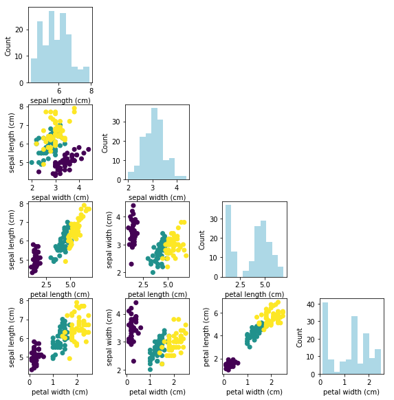
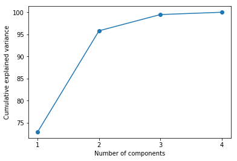
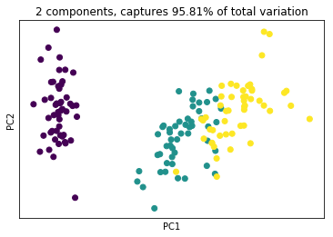

<h1 align="center"> Principal Component Analysis (PCA) from Scratch</h1>

<h1 align="center"> <a href="https://github.com/bagheri365/" target="_blank" rel="noopener noreferrer">Alireza Bagheri</a></h1>

<h1>Table of contents</h1>
<ul>
    <li><a href="#background">Background</a></li>   
    <li><a href="#Data">Data Example</a> </li>  
    <li><a href="#PCA_Cov_method">PCA with the covariance method</a></li>
    <ul>
        <li><a href="#Step_1">Step 1: Standardize the data</a></li>
        <li><a href="#Step_2">Step 2: Find the covariance matrix</a></li>
        <li><a href="#Step_3">Step 3: Find the eigenvectors and eigenvalues of the covariance matrix</a></li>
        <li><a href="#Step_4">Step 4: Rearrange the eigenvectors and eigenvalues</a></li>
        <li><a href="#Step_5">Step 5: Choose principal components</a></li>
        <li><a href="#Step_6">Step 6: Project the data</a></li>
    </ul> 
    <li><a href="#Scikit_learn">PCA with Scikit-Learn</a></li>
</ul> 

## Background <a name="background"></a>


Principal Component Analysis (PCA) is a simple dimensionality reduction technique that can capture linear correlations between the features. For a given (standardized) data, PCA can be calculated by eigenvalue decomposition of covariance (or correlation) matrix of the data, or Singular Value Decomposition (SVD) of the data matrix. The data standardization includes mean removal and variance normalization. 

## Data Example <a name="Data"></a>

In this project, we use iris dataset. The data set consists of 50 samples from each of three species of Iris. The rows being the samples and the columns being: Sepal Length, Sepal Width, Petal Length and Petal Width.


```python
from sklearn.datasets import load_iris

iris = load_iris()
X = iris['data']
y = iris['target']

n_samples, n_features = X.shape

print('Number of samples:', n_samples)
print('Number of features:', n_features)
```

    Number of samples: 150
    Number of features: 4
    

To get a feeling for how features (independent variables) are related, let us visualize them via histograms and scatter plots.


```python
import numpy as np
import matplotlib.pyplot as plt
%matplotlib inline

fig, ax = plt.subplots(nrows=n_features, ncols=n_features, figsize= (8, 8))
fig.tight_layout()

names = iris.feature_names

for i, j in zip(*np.triu_indices_from(ax, k=1)):
    ax[j, i].scatter(X[:, j], X[:, i], c = y)
    ax[j, i].set_xlabel(names[j])
    ax[j, i].set_ylabel(names[i])
    ax[i, j].set_axis_off()

for i in range(n_features):
    ax[i, i].hist(X[:, i], color = 'lightblue')
    ax[i, i].set_ylabel('Count')
    ax[i, i].set_xlabel(names[i])
```





## PCA with the covariance method <a name="PCA_Cov_method"></a>

The following step-by-step guide explains the general framework for computing PCA using the covariance method.

## Step 1: Standardize the data <a name="Step_1"></a>

We can standardize features by removing the mean and scaling to unit variance.


```python
def mean(x): # np.mean(X, axis = 0)  
    return sum(x)/len(x)  

def std(x): # np.std(X, axis = 0)
    return (sum((i - mean(x))**2 for i in x)/len(x))**0.5

def Standardize_data(X):
    return (X - mean(X))/std(X)

X_std = Standardize_data(X)
```

## Step 2: Find the covariance matrix <a name="Step_2"></a>

The covariance matrix of standardized data can be calculated as follows.


```python
def covariance(x): 
    return (x.T @ x)/(x.shape[0]-1)

cov_mat = covariance(X_std) # np.cov(X_std.T)
```

## Step 3: Find the eigenvectors and eigenvalues of the covariance matrix <a name="Step_3"></a>


```python
from numpy.linalg import eig

# Eigendecomposition of covariance matrix
eig_vals, eig_vecs = eig(cov_mat) 

# Adjusting the eigenvectors (loadings) that are largest in absolute value to be positive
max_abs_idx = np.argmax(np.abs(eig_vecs), axis=0)
signs = np.sign(eig_vecs[max_abs_idx, range(eig_vecs.shape[0])])
eig_vecs = eig_vecs*signs[np.newaxis,:]
eig_vecs = eig_vecs.T

print('Eigenvalues \n', eig_vals)
print('Eigenvectors \n', eig_vecs)
```

    Eigenvalues 
     [2.93808505 0.9201649  0.14774182 0.02085386]
    Eigenvectors 
     [[ 0.52106591 -0.26934744  0.5804131   0.56485654]
     [ 0.37741762  0.92329566  0.02449161  0.06694199]
     [ 0.71956635 -0.24438178 -0.14212637 -0.63427274]
     [-0.26128628  0.12350962  0.80144925 -0.52359713]]
    

## Step 4: Rearrange the eigenvectors and eigenvalues <a name="Step_4"></a>

Here, we sort eigenvalues in descending order.


```python
# We first make a list of (eigenvalue, eigenvector) tuples
eig_pairs = [(np.abs(eig_vals[i]), eig_vecs[i,:]) for i in range(len(eig_vals))]

# Then, we sort the tuples from the highest to the lowest based on eigenvalues magnitude
eig_pairs.sort(key=lambda x: x[0], reverse=True)

# For further usage
eig_vals_sorted = np.array([x[0] for x in eig_pairs])
eig_vecs_sorted = np.array([x[1] for x in eig_pairs])

print(eig_pairs)
```

    [(2.9380850501999953, array([ 0.52106591, -0.26934744,  0.5804131 ,  0.56485654])), (0.9201649041624866, array([0.37741762, 0.92329566, 0.02449161, 0.06694199])), (0.147741821044948, array([ 0.71956635, -0.24438178, -0.14212637, -0.63427274])), (0.020853862176462217, array([-0.26128628,  0.12350962,  0.80144925, -0.52359713]))]
    

## Step 5: Choose principal components <a name="Step_5"></a>

Now, we choose the first $k$ eigenvectors where $k$ is the number of dimensions of the new feature subspace ($k \leq n_{features}$).


```python
# Select top k eigenvectors
k = 2
W = eig_vecs_sorted[:k, :] # Projection matrix

print(W.shape)
```

    (2, 4)
    

Note that, the value of $k$ can be set in a wiser way through explained variance. The explained variance tells us how much information (variance) can be attributed to each of the principal components.


```python
eig_vals_total = sum(eig_vals)
explained_variance = [(i / eig_vals_total)*100 for i in eig_vals_sorted]
explained_variance = np.round(explained_variance, 2)
cum_explained_variance = np.cumsum(explained_variance)

print('Explained variance: {}'.format(explained_variance))
print('Cumulative explained variance: {}'.format(cum_explained_variance))

plt.plot(np.arange(1,n_features+1), cum_explained_variance, '-o')
plt.xticks(np.arange(1,n_features+1))
plt.xlabel('Number of components')
plt.ylabel('Cumulative explained variance');
plt.show()
```

    Explained variance: [72.96 22.85  3.67  0.52]
    Cumulative explained variance: [ 72.96  95.81  99.48 100.  ]
    





## Step 6: Project the data <a name="Step_6"></a>

Finally, we can transform the data $X$ via the projection matrix $W$ to obtain a $k$-dimensional feature subspace.


```python
X_proj = X_std.dot(W.T)

print(X_proj.shape)
```

    (150, 2)
    

Here, we visualize the transformed data in PCA space of the first two PCs: PC1 and PC2.


```python
plt.scatter(X_proj[:, 0], X_proj[:, 1], c = y)
plt.xlabel('PC1'); plt.xticks([])
plt.ylabel('PC2'); plt.yticks([])
plt.title('2 components, captures {} of total variation'.format(cum_explained_variance[1]))
plt.show()
```





In continute, we will put all of the above steps into a single class, train it and verify the result with Scikit-learn's PCA model.


```python
class MyPCA:
    
    def __init__(self, n_components):
        self.n_components = n_components   
        
    def fit(self, X):
        # Standardize data 
        X = X.copy()
        self.mean = np.mean(X, axis = 0)
        self.scale = np.std(X, axis = 0)
        X_std = (X - self.mean) / self.scale
        
        # Eigendecomposition of covariance matrix       
        cov_mat = np.cov(X_std.T)
        eig_vals, eig_vecs = np.linalg.eig(cov_mat) 
        
        # Adjusting the eigenvectors that are largest in absolute value to be positive    
        max_abs_idx = np.argmax(np.abs(eig_vecs), axis=0)
        signs = np.sign(eig_vecs[max_abs_idx, range(eig_vecs.shape[0])])
        eig_vecs = eig_vecs*signs[np.newaxis,:]
        eig_vecs = eig_vecs.T
       
        eig_pairs = [(np.abs(eig_vals[i]), eig_vecs[i,:]) for i in range(len(eig_vals))]
        eig_pairs.sort(key=lambda x: x[0], reverse=True)
        eig_vals_sorted = np.array([x[0] for x in eig_pairs])
        eig_vecs_sorted = np.array([x[1] for x in eig_pairs])
        
        self.components = eig_vecs_sorted[:self.n_components,:]
        
        # Explained variance ratio
        self.explained_variance_ratio = [i/np.sum(eig_vals) for i in eig_vals_sorted[:self.n_components]]
        
        self.cum_explained_variance = np.cumsum(self.explained_variance_ratio)

        return self

    def transform(self, X):
        X = X.copy()
        X_std = (X - self.mean) / self.scale
        X_proj = X_std.dot(self.components.T)
        
        return X_proj
# ---------------------------------------------------------
my_pca = MyPCA(n_components = 2).fit(X)

print('Components:\n', my_pca.components)
print('Explained variance ratio from scratch:\n', my_pca.explained_variance_ratio)
print('Cumulative explained variance from scratch:\n', my_pca.cum_explained_variance)

X_proj = my_pca.transform(X)
print('Transformed data shape from scratch:', X_proj.shape)
```

    Components:
     [[ 0.52106591 -0.26934744  0.5804131   0.56485654]
     [ 0.37741762  0.92329566  0.02449161  0.06694199]]
    Explained variance ratio from scratch:
     [0.7296244541329989, 0.22850761786701754]
    Cumulative explained variance from scratch:
     [0.72962445 0.95813207]
    Transformed data shape from scratch: (150, 2)
    

## PCA with Scikit-Learn <a name="Scikit_learn"></a>

In this section, we do PCA through Scikit-Learn package as the following.


```python
from sklearn.preprocessing import StandardScaler
X_std = StandardScaler().fit_transform(X)

from sklearn.decomposition import PCA
pca = PCA(n_components = 2).fit(X_std)

print('Components:\n', pca.components_)
print('Explained variance ratio:\n', pca.explained_variance_ratio_)

cum_explained_variance = np.cumsum(pca.explained_variance_ratio_)
print('Cumulative explained variance:\n', cum_explained_variance)

X_pca = pca.transform(X_std) # Apply dimensionality reduction to X.
print('Transformed data shape:', X_pca.shape)

plt.scatter(X_pca[:, 0], X_pca[:, 1], c = y)
plt.xlabel('PC1'); plt.xticks([])
plt.ylabel('PC2'); plt.yticks([])
plt.title('2 components, captures {}% of total variation'.format(cum_explained_variance[1].round(4)*100))
plt.show()
```

    Components:
     [[ 0.52106591 -0.26934744  0.5804131   0.56485654]
     [ 0.37741762  0.92329566  0.02449161  0.06694199]]
    Explained variance ratio:
     [0.72962445 0.22850762]
    Cumulative explained variance:
     [0.72962445 0.95813207]
    Transformed data shape: (150, 2)
    


```python
from datetime import datetime as dt
print("Completed running this Notebook at:", dt.now())
```

    Completed running this Notebook at: 2019-08-20 02:07:14.742844
    

